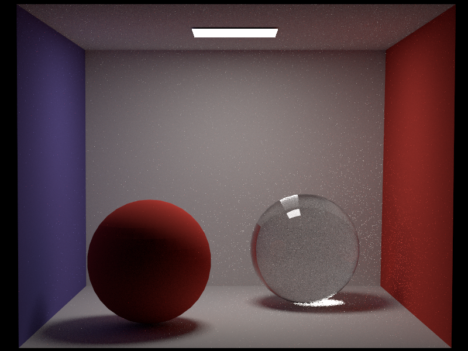

# min-ray
## Build
- Install `vcpkg`
- `vcpkg install tbb nlohmann-json fmt glfw3 spdlog gtest lodepng tinyobjloader openexr`
- `git clone --recursive https://github.com/neverfelly/min-ray.git`
- Typing command line
```shell script
mkdir build
cd build
cmake -DCMAKE_TOOLCHAIN_FILE=${vcpkg_root}/scripts/buildsystems/vcpkg.cmake ..
make -j8
```
## Gallery
CornellBox PathTracer 128spp


